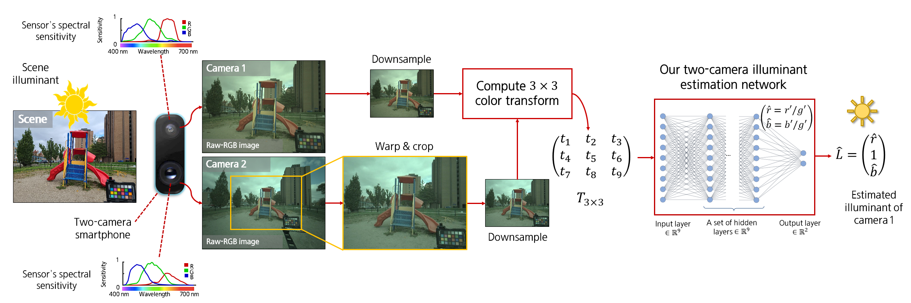

# two-camera-white-balance
Code and data for the paper: 

[Leveraging the Availability of Two Cameras for Illuminant Estimation](https://openaccess.thecvf.com/content/CVPR2021/html/Abdelhamed_Leveraging_the_Availability_of_Two_Cameras_for_Illuminant_Estimation_CVPR_2021_paper.html)

Abdelrahman Abdelhamed, Abhijith Punnappurath, Michael S. Brown

Samsung Artificial Intelligence Center, Toronto, Canada

## Goal

Illuminant estimation using two cameras. More details in this [Samsung Research blog post](https://research.samsung.com/blog/Leveraging-the-Availability-of-Two-Cameras-for-Illuminant-Estimation).



## Maintainer(s)

* Abdelrahman Abdelhamed (a.abdelhamed@samsung.com; abdoukamel@gmail.com)

## Committer(s)

* Abdelrahman Abdelhamed (a.abdelhamed@samsung.com; abdoukamel@gmail.com)

## Datasets

* [S20-Two-Camera-Dataset](https://mega.nz/folder/5hJ2nDJC#_Exw7FhB4H-Kdkd1JIsYZA)

* S20-Two-Camera-Dataset (metadata): [Metadata_Image_Pairs.zip](https://mega.nz/file/1lB2GLpA#RDT7Z53w5xunS0X98_YvmTsrpb5R36H-YoT6pJp69wI)

* S20-Two-Camera-Dataset (augmented metadata): [Metadata_Image_Pairs_Augment_99.zip](https://mega.nz/file/sth0ESqA#7a_8xCnzm0EnnPDRLqgecgLFui56lHALowe_9XO4-Jw)


## Tested environment

Ubuntu 18.04, Python 3.7, CUDA 11.2, cuDNN 8.1, TensorFlow 2.5

The code may work in other environments.

## Setup

Install required packages and setup a virtual environment:


    . ./scritps/setup.sh


## Training and Testing

#### S20-Two-Camera-Dataset, augmented, 200 parameters
    
Training: Download and unzip [Metadata_Image_Pairs_Augment_99.zip](https://mega.nz/file/sth0ESqA#7a_8xCnzm0EnnPDRLqgecgLFui56lHALowe_9XO4-Jw) into `./data` directory then run three-fold cross validation:


    python -m jobs.train_s20_aug_200_3fold


Testing: Unzip [Metadata_Image_Pairs.zip](https://mega.nz/file/1lB2GLpA#RDT7Z53w5xunS0X98_YvmTsrpb5R36H-YoT6pJp69wI) into the `./data` directory then run the following command and feed in a comma-separated string of paths to models to be tested. 


    python -m jobs.test_s20_aug_200_3fold --test_model_paths <test_model_path_1,test_model_path_2,test_model_path_3>


## Citation

If you use this code or the associated data, please cite the paper:

```
@InProceedings{Abdelhamed_2021_CVPR,
author = {Abdelhamed, Abdelrahman and Punnappurath, Abhijith and Brown, Michael S.},
title = {Leveraging the Availability of Two Cameras for Illuminant Estimation},
booktitle = {Proceedings of the IEEE/CVF Conference on Computer Vision and Pattern Recognition (CVPR)},
month = {June},
year = {2021},
pages = {6637-6646}
}
```

## Contact

[Abdelrahman Abdelhamed](https://abdokamel.github.io/) - [(a.abdelhamed@samsung.com; abdoukamel@gmail.com)](mailto:a.abdelhamed@samsung.com;abdoukamel@gmail.com)

